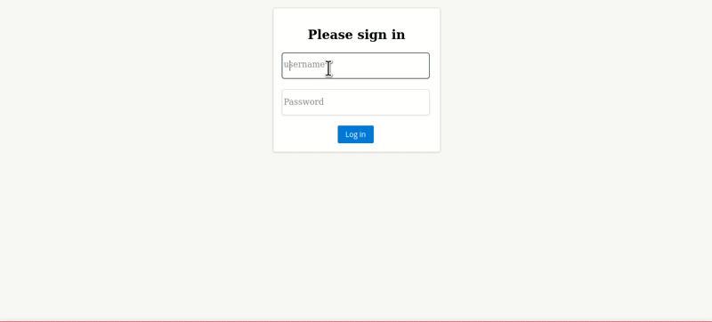

# Waspmote sensors visualization

### ***Requirements***:

1. **Read** <code>attached</code> and <code>on-board</code> sensors of a waspmote node ***once in a given period of time***.
2. **Send** <code>collected data</code> to the server over ***wifi***.
3. **Save** incoming to the server <code>data</code> into a ***database***.
4. **Expose** server <code>resources</code> only to ***authorized*** users. 
5. **Build** a <code>client</code> application in order to ***visualize*** sensors measurements.

***Technologies***:
- **C++ Waspmote APIs** for data acquisition system.
- **WSO2 Ballerina** for backend services.
- **Json Web Token** for authorization.
- **Elasticsearch** for storing data.
- **Angular** | **PrimeNG** | **three.js** for visualizations.  

## Getting Started

### Essentials about data acquisition process

1. The waspmote platform has to be in a sleep state as long as possible in order to reduce the energy consumption. Thus it executes the needed operations based on two interruptions:
   - **Pluviometer interruptions** - whenever the pluviometer bucket is tipped an alarm is raised and waspmote wakes up to store the pluviometer pulses which will be used later on.
   - **RTC interruptions** - whenever the real time clock triggers an alarm, waspmote wakes up to read all the sensors ***(wind speed, wind direction, pluviometer stored pulses, accelerometer, temperature, soil temperature, battery level)*** and try to send collected data to the server. Waspmote enters sleep mode again and the process is repeated over .

2. In order to send data waspmote creates a <code>frame</code> structure and initiate a <code>TCP connection</code>. If the server is not responding, the frame is lost.

### Essentials about backend services

There are 4 services:

1. **boardFrameReaderService** - designates a port to listen for waspmote frames and creates a <code>byteChannel</code> to ***read, parse and model*** the frame content in such a way that would match the elasticsearch schema.

2. **indexingService** - creates an elasticsearch instance and designates a port and a path on which the <code>indexing</code>/<code>persistance</code> operation is available. 

3. **frontEndClientListenerService** - creates a <code>jwtAuthHandler</code> and  two ***protected*** resources through which elasticsearch gets consumed.

4. **jwtIssuerListenerService** - creates a <code>mock</code>/<code>hardcoded</code> user (*admin* *admin*) for which emits a 2 minutes valid <code>jwt</code>.

### Essentials about client application

Visualizations is available to an authorized user within a <code>dashboard</code> component which assembles the <code>charts</code> and <code>three.js scene</code> components. Data is obtained using the <code>polling</code> technique and it is flowing from the dashboard to its child components:

1. **LineChart** *(rainfall - **mm/day** && **mm/h**)* and **BarChart** *(temperature - **C**)* displays multiple values, meaning they can represent the entire array of fetched data, whereas...
   
2. the **DoughnutChart** *(battery - **%**)* and **RadarChart** *(vane)* represent single values, meaning they show up the data of a specific index from within fetched array and in order to see the wind speed and direction and the battery level at a certain point of time, the user should click on a LineChart point or BarChart bar specific to that point of time and the DoughnutChart and RadarChart get updated. 
   
3. The **three.js scene** is meant to show waspmote board position with use of the calculated <code>roll</code> and <code>pitch</code> based on the 3 axes acceleration. The position is updated every time the scene is clicked.
  
4. User can also perform a simple filtering operation based on dates.

5. The application uses an **interceptor** component which enriches the <code>header</code> of every <code>request</code> with needed <code>metadata</code> including the <code>authorization bearer</code> in case it is not expired yet.

## Demo

